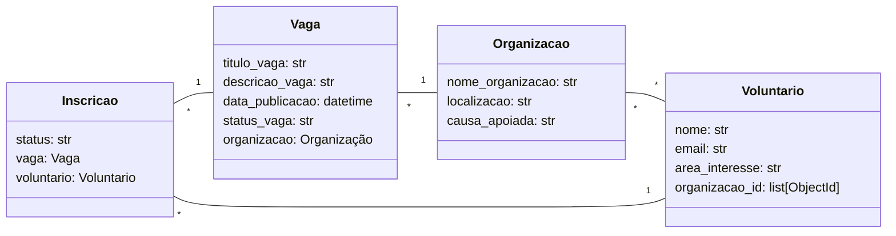

*  Diagrama UML

```mermaid
    classDiagram
    direction RL
    class Voluntario {
        nome: str
        email: str
        area_interesse: str
        organizacao_id: list[ObjectId]
    }

    class Organizacao {
        nome_organizacao: str
        localizacao: str
        causa_apoiada: str
    }

    class Vaga {
        titulo_vaga: str
        descricao_vaga: str
        data_publicacao: datetime
        status_vaga: str
        organizacao: Organização
    }

    class Inscricao {
        status: str
        vaga: Vaga
        voluntario: Voluntario
    }

    Voluntario "*" -- "*" Organizacao
    Organizacao "1" -- "*" Vaga
    Vaga "1" -- "*" Inscricao
    Voluntario "1" -- "*" Inscricao

```
